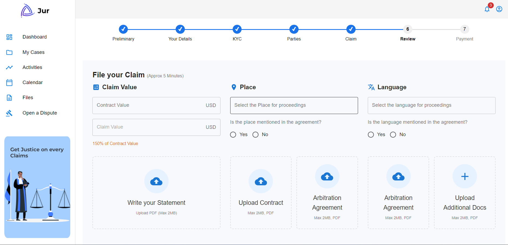
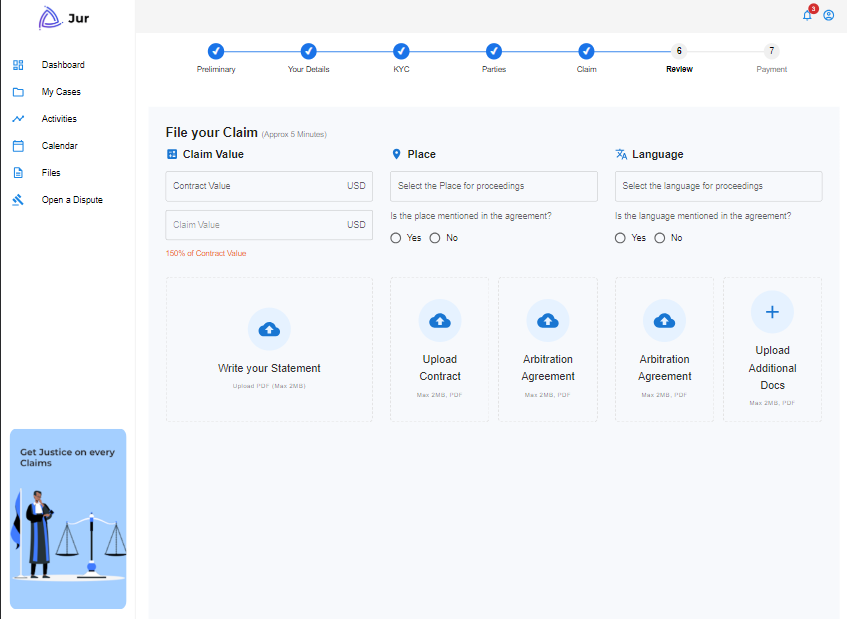
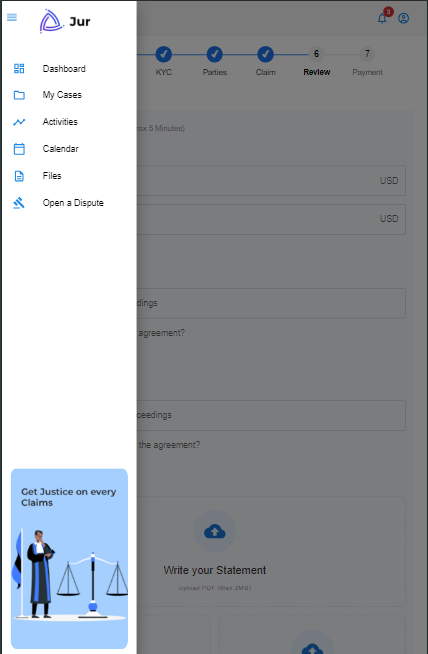
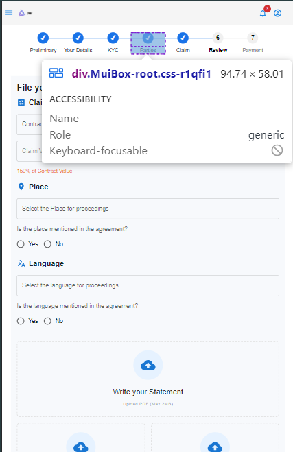

# Construction Dashboard

## Overview

The **Construction Dashboard** is a dynamic, interactive platform built to track and manage the progression of various construction steps. Utilizing React and Material UI (MUI), the dashboard visually represents key milestones in the process, such as **Preliminary**, **Your Details**, **KYC**, and more. The dashboard provides users with an intuitive and mobile-friendly interface to easily navigate between steps and monitor their status.

## Approach

### 1. **Project Setup**
   - The dashboard was developed using **React** for the frontend and **Material UI (MUI)** for building responsive and visually appealing components.
   - To ensure smooth navigation, **React Router** was implemented to handle routing between different steps of the process.
   - The progress tracking feature was designed with a custom **ProgressBar** component built using MUI’s `Box`, `Typography`, and `StepLine` components.

### 2. **Stepper Design**
   - The **ProgressBar** visually represents the current step and overall progress, updating as users complete different stages.
   - Clicking on any step within the ProgressBar navigates to that specific step, while also highlighting the current position.
   - The **MobileStepper** is designed for smaller devices like tablets and phones, offering users buttons to move forward and backward through the process.
   - The layout adapts based on screen size, utilizing **MUI’s breakpoints** to switch between the **ProgressBar** on larger screens and the **MobileStepper** on smaller devices.

### 3. **Navigation Logic**
   - Navigation is handled using React Router’s `useNavigate` hook, which allows programmatic routing to different steps of the process based on user interactions.
   - Each step corresponds to a unique URL (e.g., `/preliminary`, `/yourdetails`, `/kyc`) for a seamless user experience.

### 4. **Responsive Design**
   - The dashboard is built with mobile-first principles in mind. It dynamically switches between a **ProgressBar** for larger screens and a **MobileStepper** for smaller screens, ensuring an optimal experience across all devices.

## Challenges Faced & Solutions

### 1. **Navigation and Step Tracking**
   - The main challenge was ensuring that the navigation logic for each step was correctly mapped and that the progress indicator updated as users clicked through the steps.
   - **Solution**: I utilized `useNavigate` to allow for smooth programmatic navigation and ensured the correct step was highlighted by managing the `currentStep` state.

### 2. **Ensuring Responsiveness**
   - Another challenge was making sure that the layout adjusted correctly for various screen sizes, especially with the visibility of the ProgressBar and MobileStepper.
   - **Solution**: Using **MUI’s Grid** and **Box** components, along with **CSS breakpoints**, I made sure that the dashboard displayed the appropriate component based on the device width.

### 3. **Smooth Transitions Between Steps**
   - Maintaining smooth transitions while tracking progress between steps was tricky.
   - **Solution**: I managed the state transitions within the **ProgressBar** component to update the `currentStep` state, allowing for clear and smooth movement through the steps.

## Assumptions Made

1. **Navigation Flow**: The steps are assumed to follow a fixed order, meaning each step must be completed before the next step is accessed.
2. **Mobile-First**: The design is based on a mobile-first approach, with different layouts for mobile and desktop views.
3. **Use of React Router**: It was assumed that React Router would handle routing between the steps in a clean and modular way.

## Dashboard Views

### Desktop View


### Tablet View


### Mobile View



## Installation

To run this project locally, follow the steps below:

1. **Clone the repository**:

   ```bash
   git clone <repository-url>
